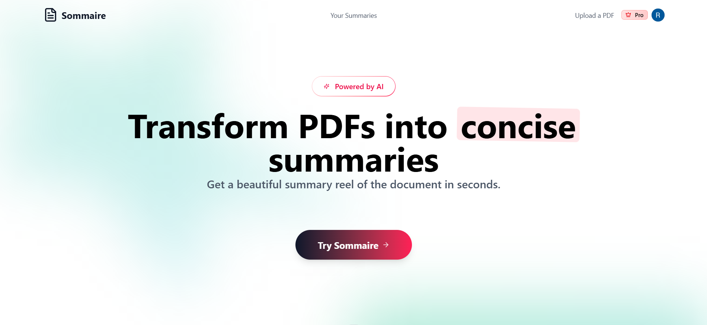

<div align="center">
  
  <h1>Sommaire</h1>
  <p><strong>AI-Powered Document Summarization Platform</strong></p>
  
  [](https://nextjs.org/)
  [](https://tailwindcss.com/)
  [](https://ai.google.dev/)
  [](https://sommaire-kv.vercel.app)
  
  <p>Transform lengthy PDFs into clear, accurate summaries in seconds with advanced AI technology</p>
  
  <a href="https://sommaire-kv.vercel.app" target="_blank">
    
  </a>
</div>

---

## 📋 Table of Contents

- [Overview](#-overview)
- [Features](#-features)
- [Tech Stack](#-tech-stack)
- [Getting Started](#-getting-started)
- [Usage](#-usage)
- [License](#-license)
- [Contact](#-contact)
- [Acknowledgements](#-acknowledgements)

## 🎯 Overview

**Sommaire** (French for "summary") is an intelligent document summarization platform that transforms complex PDFs into clear, concise summaries using state-of-the-art AI technology.

<details>
<summary><strong>Why Sommaire?</strong></summary>
<br>

- **Save Time**: Extract key insights from lengthy documents in seconds
- **Improve Comprehension**: Get the essential information in an easy-to-digest format
- **Boost Productivity**: Focus on what matters most in your reading materials
- **Enhance Learning**: Quickly grasp complex concepts from academic papers and textbooks
- **Make Better Decisions**: Get the information you need without wading through pages of text

</details>

<div align="center">
  
</div>

## ✨ Features

<table>
  <tr>
    <td width="50%">
      <h3>🚀 Instant Summarization</h3>
      <p>Upload PDFs up to 32MB and receive beautifully formatted summaries in seconds</p>
    </td>
    <td width="50%">
      <h3>🧠 Multi-AI Engine</h3>
      <p>Powered by OpenAI GPT-4o with Google Gemini 2.0 fallback for reliability</p>
    </td>
  </tr>
  <tr>
    <td width="50%">
      <h3>📱 Responsive Design</h3>
      <p>Beautiful interface that works flawlessly across desktop, tablet, and mobile</p>
    </td>
    <td width="50%">
      <h3>🔐 Secure Authentication</h3>
      <p>User accounts with Clerk for secure, seamless authentication</p>
    </td>
  </tr>
  <tr>
    <td width="50%">
      <h3>📊 Personal Dashboard</h3>
      <p>Track, manage, and revisit all your summarized documents</p>
    </td>
     <td width="50%">
      <h3>⚡ Fast Performance</h3>
      <p>Optimized for speed with Next.js and Vercel Edge Functions</p>
    </td>
  </tr>
</table>

## 🛠️ Tech Stack

<details>
<summary><strong>Frontend</strong></summary>
<br>

- **Framework**: [Next.js 15](https://nextjs.org/) with React 19
- **Styling**:
  - [Tailwind CSS 4](https://tailwindcss.com/) for utility-first CSS
  - [shadcn/ui](https://ui.shadcn.com/) for accessible, customizable UI components
- **UI Components**:
  - [Radix UI](https://www.radix-ui.com/) for accessible primitives
  - [Lucide React](https://lucide.dev/) for beautiful SVG icons
  - [Sonner](https://sonner.emilkowal.ski/) for toast notifications
  - [Next Themes](https://github.com/pacocoursey/next-themes) for theme management
- **Animations**: Custom animations with [Motion](https://motion.dev/)
- **Typography**: Source Sans 3 from Google Fonts

</details>

<details>
<summary><strong>Backend & Infrastructure</strong></summary>
<br>

- **Runtime**: Next.js App Router with Server Components and Server Actions
- **Authentication**: [Clerk](https://clerk.dev/) for user management and authentication
- **Database**:
  - [Neon Database](https://neon.tech/) (PostgreSQL) for serverless SQL storage
  - Connection via `@neondatabase/serverless`
- **File Handling**:
  - [UploadThing](https://uploadthing.com/) for secure file uploads and storage
  - PDF-parse for document text extraction

</details>

<details>
<summary><strong>AI & Document Processing</strong></summary>
<br>

- **AI Integration**:
  - [Google Generative AI](https://ai.google.dev/) with Gemini 2.0 Flash as primary model
  - [OpenAI API](https://openai.com/blog/openai-api) with GPT-4o model as fallback
- **Document Processing**:
  - [LangChain](https://js.langchain.com/) for document loading and text extraction
  - Custom prompt engineering for optimal summarization results
  - Automatic fallback between AI providers for reliability

</details>

<details>
<summary><strong>Development & Deployment</strong></summary>
<br>

- **Language**: JavaScript with TypeScript support
- **Type Safety**:
  - TypeScript for type checking
  - Zod for runtime validation
- **Code Quality**:
  - Prettier with Tailwind plugin
  - ESLint for code linting
- **Build Tools**: Turbopack for faster development builds
- **Deployment**: [Vercel](https://vercel.com) for production hosting

</details>

## 🚀 Getting Started

### Prerequisites

- Node.js (v18 or higher)
- npm, yarn, or pnpm

### Installation

1. **Clone the repository**

   ```bash
   git clone https://github.com/yourusername/sommaire.git
   cd sommaire
   ```

2. **Install dependencies**

   ```bash
   npm install
   # or
   yarn install
   # or
   pnpm install
   ```

3. **Set up environment variables**

   Create a `.env.local` file in the root directory:

   ```env
   # AI Providers
   OPENAI_API_KEY=your_openai_api_key
   GOOGLE_API_KEY=your_google_api_key

   # Authentication
   CLERK_SECRET_KEY=your_clerk_secret_key
   CLERK_PUBLISHABLE_KEY=your_clerk_publishable_key
   CLERK_WEBHOOK_SECRET=your_clerk_webhook_secret

   # File Upload
   UPLOADTHING_TOKEN=your_uploadthing_token

   # Database
   DATABASE_URL=your_neon_database_url

   # Payment
   NEXT_PUBLIC_RAZORPAY_KEY_ID=your_razorpay_key_id
   RAZORPAY_KEY_SECRET=your_razorpay_key_secret
   RAZORPAY_PLAN_ID=your_razorpay_plan_id
   ```

4. **Start the development server**

   ```bash
   npm run dev
   # or
   yarn dev
   # or
   pnpm dev
   ```

5. **Open your browser**

   Navigate to [http://localhost:3000](http://localhost:3000) to see the application.

## 📝 Usage

<details>
<summary><strong>Summarizing a Document</strong></summary>
<br>

1. **Sign in** to your Sommaire account
2. Click on the **Upload** button in the navigation
3. Wait while our AI processes your document
4. View your **beautifully formatted summary** with key insights
5. **Save** your summary

</details>

<details>
<summary><strong>Managing Your Summaries</strong></summary>
<br>

1. Navigate to your **Dashboard**
2. View all your previously summarized documents
3. Click on any summary to view the full details
4. Use the **delete** option to remove unwanted summaries

</details>

## 📄 License

This project is licensed under the MIT License - see the [LICENSE](LICENSE) file for details.

## 👤 Contact

<div align="center">
  
  <h3>Kaushik Verma</h3>
  
  [](mailto:kauhsikverma321@gmail.com)
  [](https://kaushikverma.me/)
  [](https://github.com/kaushik-2318)
</div>

## 🙏 Acknowledgements

- [Next.js](https://nextjs.org/) for the incredible React framework
- [OpenAI](https://openai.com/) and [Google](https://ai.google.dev/) for their powerful AI models
- [Vercel](https://vercel.com/) for hosting and deployment
- [shadcn/ui](https://ui.shadcn.com/) for the beautiful UI components
- All open-source libraries that made this project possible

---

<div align="center">
  <p>If you found this project helpful, please consider giving it a ⭐️</p>
  
  [](https://github.com/kaushik-2318/sommaire)
</div>
